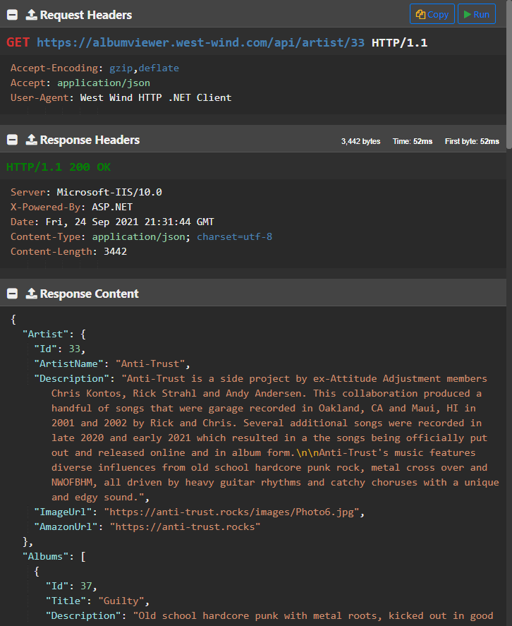
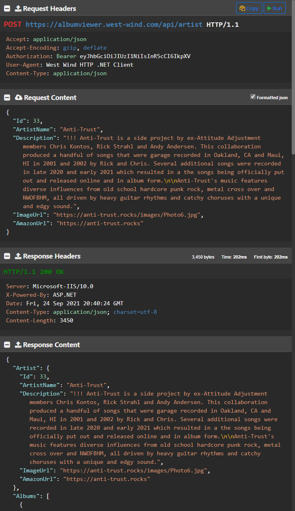
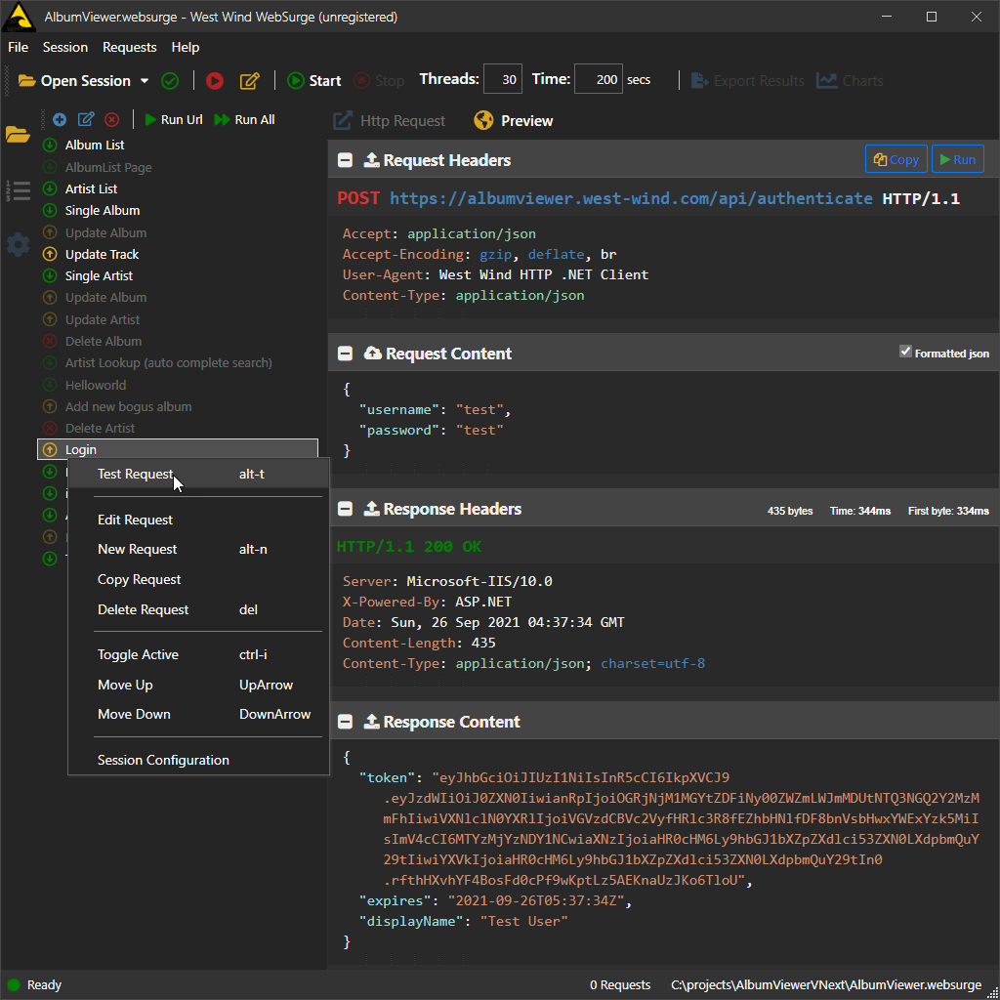
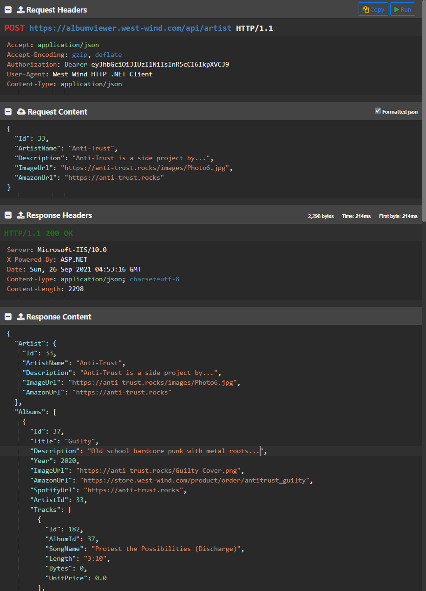
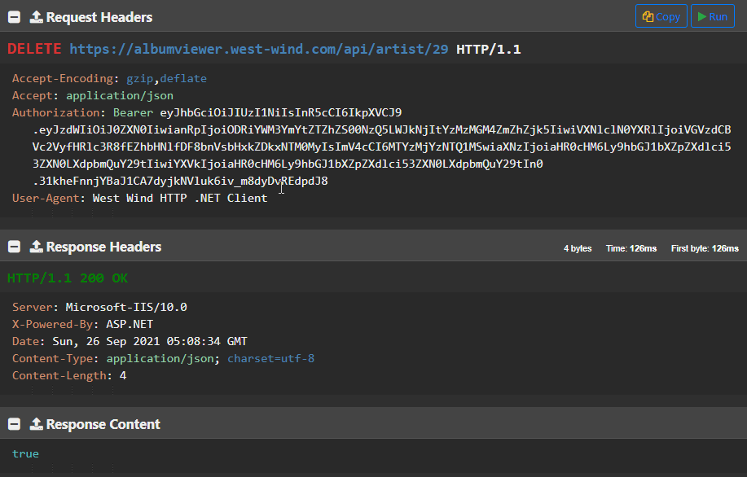
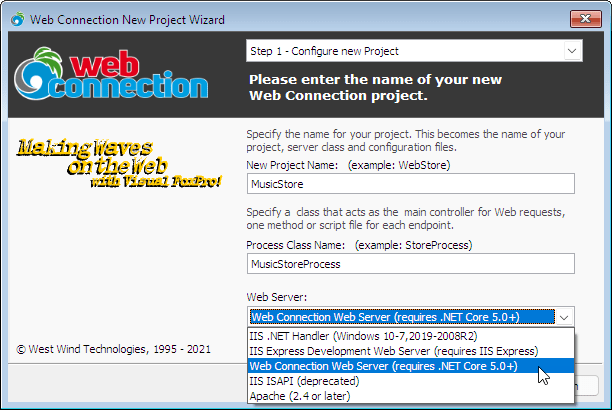
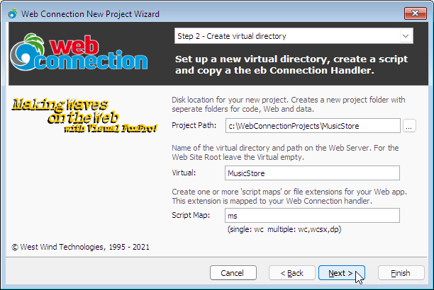
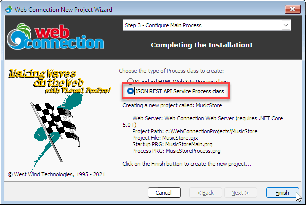
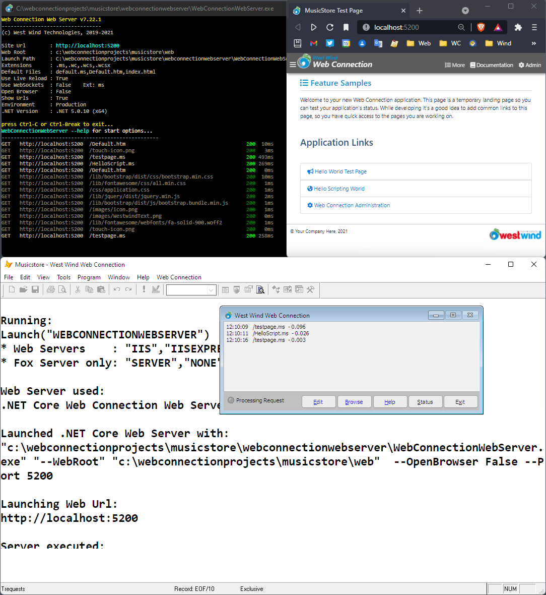

# Creating and Consuming REST Services with FoxPro

REST APIs, or Web Services that use plain HTTP requests and JSON have become the replacement for more complex SOAP based service architectures of the past. Most modern APIs available on the Web — from Credit Card Processors, to eCommerce back ends, to mail services, Cloud Provider APIs and Social Media data access —  all use REST services or variants thereof to make remote data available for remote interaction. 

REST services tend to be much simpler to build and consume than SOAP, because they don't require any custom tooling as SOAP/WSDL services did. They use the HTTP protocol for sending requests over the Web, and typically use JSON's as their serialization format. JSON's simple type structure is inherently easier to create and parse into object structures from a language like FoxPro and REST's clear separation between the message (JSON) and the protocol layers (HTTP Headers/Protocol) reduces the amount of infrastructure that is required in order to use the technology.

Because of its simplicity REST can also be directly consumed by Web applications rather than going through a server proxy. JSON is a JavaScript native format (essentially an object literal) and so JavaScript based applications can easily consume REST services directly.

This makes REST useful for double duty both as a remote data service API and a backend for internal Web applications. Often these two tasks can overlap, with applications exposing both the Web application for interactive use (SPA applications) and a service for remote data API access. Many big services like Twitter, Facebook and Cloud Providers like Azure use APIs to drive their front ends while also exposing those same APIs for remote access.

One of the big reasons of REST's popularity and success in recent years is its simplicity: All you need to consume a REST Service is an HTTP Client and a JSON parser. On the server too no special tools are required beyond a Web Server and the ability to capture HTTP requests and write HTTP responses which means that its easy to create REST service endpoints manually, and there are lots of support frameworks to choose from to provide automated REST service integrations.

## Client and Server
For developers there are two scenarios that you're going to deal with when it comes to REST Services:

* Consuming REST Services
* Creating Server APIs using REST

In this article I'll talk about both of these scenarios in the context of Visual FoxPro. We'll start with retrieving some data from an HTTP service and consuming it in FoxPro, and then jump to the other end and create a REST JSON service on the server side using [Web Connection](https://webconnection.west-wind.com). 

But before the practical bits, let's talk about what REST is and what makes it unique and how it differs from what came before.

## So what is REST?
Unlike older protocols like SOAP, REST is not a standard and doesn't have a formal definition. Rather it's a set of common *'recommendations'* or a *'style'* of building HTTP based Web Services.

Officially REST stands for **Representational State Transfer** which is a fairly cryptic term to describe what amounts to Web based APIs. The idea of the term is that you have fixed URLs from which you can transfer state - or data - back and forth between a client and server. 

REST is not a specific standard or even a specification. There's no Web site that you can go to to look up how to specifically architect your HTTP Service. Rather it's a loose set of 'recommendations' based on the semantics of the HTTP protocol.

Since there isn't a fixed standard you can look at, here's Wikipidia's broad definition:

> Representational state transfer (REST) is a software **architectural style** that was created to guide the design and development of the architecture for the World Wide Web. REST defines a **set of constraints** for how the architecture of an Internet-scale distributed hypermedia system, such as the Web, should behave. The REST architectural style emphasizes the scalability of interactions between components, uniform interfaces, independent deployment of components, and the creation of a layered architecture to facilitate caching components to reduce user-perceived latency, enforce security, and encapsulate legacy systems.

As you can see this is pretty vague and open to interpretation with words like **architectual style** and general **set of constraints**. There's nothing specific about this 'recommendation', other than it uses HTTP to access and send data.

## REST is all about HTTP
REST is all about taking maximum advantage of the HTTP Web protocol. 

HTTP is the protocol used to communicate on the Web. HTTP traditionally has been the protocol of Web Browsers, but more recently the use of Web APIs increasingly sees HTTP use by applications using HTTP client software either built into frameworks or tools used with various languages. Most mobile apps and many desktop applications these days use REST based API calls to provide their data used in these native applications as well. In short, HTTP is very prominently used in today's modern applications.

The HTTP protocol is used to send and retrieve data in a simple, one-way transactional manner: A request is made with headers and content, and a response is returned also with headers and content. Requests only go one way from the client to the server. While the server can return data from a request, it cannot directly call back to a client (technically it's possible using WebSockets but that's another store for another day).

Finally HTTP is inherently stateless - each request has to provide its own context to the server as it opens and closes a connection to the server. There's no explicit persistent state across requests unless some mechanism like HTTP Cookies or custom headers are used to forward information between requests. It's unusual though to use these mechanisms for APIs. The only persistant state that's usually required is `Authorization` for which there are other ways such as Bearer Tokens headers that can be sent on every request.


Here's what the HTTP Request and Response are made up of:

**Request**

* HTTP Host and Path (Url)
* HTTP Verb (`GET`, `POST`, `PUT`, `DELETE`, `OPTIONS`)
* HTTP Request Headers
* Request Body (for `POST` and `PUT`)
* Request Body is usually JSON  
  *but can be any other raw data (xml, binary, form data)*

**Response**

* HTTP Response Headers
* Response Body

So here's what this looks like in a couple of live requests. This first example is a simple `GET` request that only retrieves data:



 `GET` describes the HTTP verb used against the URL which retrieves an Artist. `GET` is a retrieval only request - no data is sent to server.
 
 Any REST request lives at a fixed URL which is unique, and is accessed via an HTTP Verb - `GET` in this case. The combination of URL + HTTP Verb make for a unique resource that can be easily linked to or bookmarked in browsers. Commonly used verbs are `GET`, `POST`, `PUT`, `DELETE`, `OPTIONS` which describe an 'action' on the resource you are accessing. Multiple verbs are often overloaded on a single URL that have different behavior depending on using a `GET` to retrieve and Artist for example, or `POST`/`PUT` to add or update and `DELETE` to delete.
 
 The response in this example returns the requested Artist as a JSON (`application/json`) response. The response consists of HTTP headers that describe protocol and content information from the server and can also be used to send non-data related meta-data from the application to the client. 
 
 The second example, uses a `POST` operation to add/update an Artist which looks similar but adds Request Content to send to the server:
 


This particular request is an update operation that updates an Artist in a music store application. 

The POST operation is different in that it uses the `POST` verb, and provides a content body that contains the JSON request data. The data sent can be raw data like a JSON or XML document, but can also be Urlencoded form data, a multipart form upload, raw binary data like Pdf or Zip file... it can be anything. Whenever you send data to the server you have to specify a `Content-Type` so that the server knows how to handle the incoming data. Here the data is JSON so `Content-Type: application/json`.

The HTTP Headers provide protocol instructions and information such as the calling browser, what type of content is requested or optionally sent, and so on. Additionally you can also handle security via the `Authorization` header. This example uses a Bearer token that was previously retrieved via a Authentication API call. Headers basically provide meta data: Data that describes the request, or additional data that is separate from the data in the content of a request.

`POST` and `PUT` requests like the one above also have a request body, which is raw data sent to the server. Here the data sent is serialized JSON of an Artist object. Other verbs like `GET`, `DELETE`, `OPTIONS`, `PATCH` etc. don't have a Request body. In fact, `GET` request is considerably simpler:

### HTTP Advantages
HTTP is a great mechanism for applications because it provides many features 'out of the box' that don't have to be implemented for each tool or application.

Here are a few things that REST can take advantage of with HTTP:

* API Routing via URL
* Unique Resource Access via URL
* API Operations via HTTP Verbs
* API Encryption via HTTPS (TLS)
* Caching via HTTP Resource Caching
* Authorization via HTTP Authorization (+server auth support)
* Meta Data via HTTP Headers

### HTTP Routing plus HTTP Verbs
HTTP has an innate built-in unique routing mechanism based on URLs. Any URL by its nature is a unique identifier, so each endpoint you create via an HTTP API is always unique in combination with an HTTP Verb.

A url like:

```text
https://albumviewer.west-wind.com/api/artists  GET
```

is 100% unique. 

So are these even though they point at the same URL:

```text
https://albumviewer.west-wind.com/api/artists  POST
https://albumviewer.west-wind.com/api/artists  DELETE
```

Same URL different action, but different actions that are interpreted separately in the server application.

There are quite a few Verbs available and each has a 'suggested' meaning.

* **GET**: Retrieve data
* **POST**: Add data
* **PUT**: Update data
* **DELETE**: Delete data
* **OPTIONS**: Return headers only
* **PATCH**: Partial Update

Of these `POST` and `PUT` are the only ones that support a content body to send data to the server. All others are either data retrieval or operation commands.

These verbs are suggestions. Requests are not going to fail if you update data via a `POST` operation instead of using the suggested `PUT`. However, it's a good idea to follow these rules as best as possible for consistency, and easy understanding of your API. It'll make your API easier to use.


### Encrypted Content via HTTPS
HTTP has built in support for `https://` which uses certificate based security keys for encrypting content between client and server. This encryption ensures that content on the wire is encrypted and can't be spied upon without access to the keys of the certificates on both sides of the connection. This avoids man in the middle attacks. To use `https://` encryption a server secure certificate is required but these days you can set up free LetsEncrypt Certificates on most Web servers in minutes. For Windows Server and IIS look at [Win-Acme](https://www.win-acme.com/) to set up Lets Encrypt certificates on IIS for free.

The nice thing with `https://` is that it's part of the server infrastructure. As long as the server has a certificate, both client and server can use the `https://` protocol to securely access requests.

### Resource Caching
Each URL + Verb on an API endpoint is unique in the eyes of the browser and if you access the same resource using a read (ie. `GET`) operation, requests are cached on subsequent access by default. By default requests are expected to be idempotent which means that sending a request in the same way twice should always produce the same result. HTTP provides this functionality by default, but it can be overridden with specific HTTP headers that force the client to refresh data. This makes sense in some cases where data changes frequently.

### Authorization and Authentication
HTTP doesn't have direct support for authentication besides the `Authorization` header that is commonly used by server frameworks to handle Authorization and Authentication. Most server frameworks today have some basic mechanisms for handling security built-in. Most Web Servers have support for Basic Authentication out of the box, IIS additionally has support for Windows Auth, and if you use an application framework like ASP.NET MVC or ASP.NET Core they also have built-in support for handling Cookie and Bearer token authentication as well as various federated frameworks.

### Meta Data in HTTP Headers
Unlike SOAP, REST clearly separates the content from meta data that describes the request or response. So the content sent and returned tends to be truly application specific while anything that involves the request processing or tracking generally is handled in the headers of the request.

Every request has a handful of required headers that are always sent by the client and are always returned by the server. These describe the basics of the request or response and include things like the content type, content-length, the accepted types of content, browser and so on. 

But beyond the auto-generated headers, you can also add custom headers of your own to both the client request and the server response. You should use headers to return data that is important to the application, but not directly part of the data. This could be cached state (similar to cookies) that you carry from request to request, or identifying information.

## Calling REST APIs from FoxPro
Ok - enough theory let's kick the tires and use some RESTful APIs. Let's start with what's required to call a REST service from Visual FoxPro:

* **HTTP Client**  
    * [wwHttp](https://webconnection.west-wind.com/docs/_0jj1abf2k.htm) (West Wind Tools)
    * WinHttp (GitHub Example)
    * MSXML.ServerXMLHttp
    * curl

* **JSON Parser**   
    * [wwJsonSerializer](https://webconnection.west-wind.com/docs/_1wu18owba.htm) (West Wind Tools)
    * [nfJson](https://github.com/VFPX/nfJson)

### Http Client
There are a lot of options for HTTP access. I'm obviously biased towards the `wwHttp` library as that's what I usually use and as it provides full featured HTTP support for many different scenarios. That's what I'll use for the examples here and the support libraries are provided with the samples.

#### A simple WinHttp Client
If you'd rather use a native tool without extra dependencies you can use WinHttp which is built into Windows. A very simplistic, generic HTTP client looks something like this:

```foxpro
************************************************************************
*  WinHttp
****************************************
FUNCTION WinHttp(lcUrl, lcVerb, lcPostData, lcContentType)
LOCAL lcResult, loHttp

*** FOR DEMOS ONLY!
IF EMPTY(lcUrl) 
   lcUrl = "https://albumviewer.west-wind.com/api/artist/1"
   ** RETURN null
ENDIF
IF EMPTY(lcVerb)
   lcVerb = "GET"
   IF !EMPTY(lcPostData)
      lcVerb = "POST"
   ENDIF
ENDIF

*** Example of using simplistic WinHttp client to retreive HTTP content
LOCAL loHttp as WinHttp.WinHttpRequest.5.1, lcResult
loHTTP = CREATEOBJECT("WinHttp.WinHttpRequest.5.1")    

loHTTP.Open(lcVerb, lcUrl,.F.)

IF !EMPTY(lcContentType) AND lcVerb = "POST" OR lcVerb = "PUT" 
	loHttp.SetRequestHeader("Content-Type",lcContentType)
ENDIF	

*** If using POST you can post content as a parameter
IF !EMPTY(lcPostData)
	loHTTP.Send(lcPostData)
ELSE
   loHttp.Send()	
ENDIF

lcResult = loHttp.ResponseText

loHttp = NULL

RETURN lcResult
```

You can use it with very simple code like this:

```foxpro
SET PROCEDURE TO WinHttp ADDITIVE

lcResult = WinHttp("https://albumviewer.west-wind.com/api/artist/1")
? PADR(lcResult,1000)

TEXT TO lcJson NOSHOW
{
  "username": "test",
  "password": "test"
}
ENDTEXT

lcResult = WinHttp("https://albumviewer.west-wind.com/api/authenticate","POST",;
                   lcJson,"application/json")
? lcResult   
```

This wrapper works but it's a pretty basic implementation. It needs additional error handling, dealing with binary data, message updates and a few other things, but for starters it's a workable solution.

#### wwHttp - A little Extra
wwHttp provides a lot more functionality out of the box, supporting many of the more obscure HTTP features. It supports a number of convenience helpers to make it easy to parse both content and headers, encode and decode content, handle Gzip/Deflate compression, binary content, status updates and more. A version of wwHttp is provided with the samples.

Using the same service as above using `wwHttp` looks something like this:

```foxpro
DO wwHttp  && load libraries

loHttp = CREATEOBJECT("wwHttp")
lcResult = loHttp.Get("https://albumviewer.west-wind.com/api/artist/1")
? PADR(lcResult,1200)

TEXT TO lcJson NOSHOW
{
  "username": "test",
  "password": "test"
}
ENDTEXT

loHttp = CREATEOBJECT("wwHttp")
loHttp.cContentType = "application/json"
lcResult = loHttp.Post("https://albumviewer.west-wind.com/api/authenticate",lcJson)

IF loHttp.nError # 0
   ? loHttp.cErrorMsg
   RETURN
ENDIF
IF loHttp.cResultcode # "200"
   ? "Invalid HTTP response code: " + loHttp.cResultCode
ENDIF   

? lcResult  
```

### JSON Serialization and Parsing
Next you need a JSON serializer that can turn your FoxPro objects into JSON, and turn JSON back into FoxPro objects, values or collections. I'm going to use `wwJsonSerializer` here since that's all I use, but there are other open source libraries available as well. The logic should be similar.

#### Objects, Values and Collections
Using  `wwJsonSerializer` to turn a FoxPro object into a JSON looks something like this:

```foxpro
DO wwJsonSerializer && Load libs

*** Create a complex object
loCust = CREATEOBJECT("Empty")
ADDPROPERTY(loCust,"Name","Rick")
ADDPROPERTY(loCust,"Entered",DATETIME())

*** Create a nested object
ADDPROPERTY(loCust,"Address", CREATEOBJECT("Empty"))
ADDPROPERTY(loCust.Address,"Street","17 Aluui Place")
ADDPROPERTY(loCust.Address,"City","Paia")
ADDPROPERTY(loCust,"Number",32)

loSer = CREATEOBJECT("wwJsonSerializer")

*** Serialize into JSON
lcJson =  loSer.Serialize(loCust)

? lcJson


*** read back from JSON into an object
loCust2 = loSer.DeserializeJson(lcJson)

? loCust2.Name
? loCust2.Entered
? loCust2.Address.Street 
? loCust2.Number
```

This creates JSON like this:

```json
{ 
  "address": {
        "city": "Paia",
        "street": "17 Aluui Place"
  }, 
  "entered": "2021-09-25T01:07:05Z",
  "name": "Rick",
  "number": 32
}
```

### Simple Values
JSON has literal values for simple types and you can serialize and deserialize these simple values.

```foxpro  
? loSer.Serialize("One" + CHR(10) + "Two" +;    && "One\nTwo\nThree"
                  Chr(10) + "Three") 
? loSer.Serialize(1.22)                         && 1.22
? loSer.Serialize(.T.)                          && true
? loSer.Serialize(DateTime())                   && "2020-10-01T01:22:15Z"

*** Binary Values as base64
? loSer.Serialize( CAST("Hello World" as Blob)) && "SGVsbG8gV29ybGQ="
```

#### Collections and Arrays
Single dimension arrays and collections are supported for serialization. This is common for serializing object arrays, or just representing db records as objects for example. 

```foxpro
loSer = CREATEOBJECT("wwJsonSerializer")

loCol = CREATEOBJECT("Collection")

loCust = CREATEOBJECT("Empty")
ADDPROPERTY(loCust,"Name","Rick")
ADDPROPERTY(loCust,"Company","West Wind Technologies")
ADDPROPERTY(loCust,"Entered",DATETIME())

loCol.Add(loCust)

loCust = CREATEOBJECT("Empty")
ADDPROPERTY(loCust,"Name","Kevin")
ADDPROPERTY(loCust,"Company","OakLeaf")
ADDPROPERTY(loCust,"Entered",DATETIME())
loCol.Add(loCust)

? loSer.Serialize(loCol, .T.)
```

The result is a top level JSON array of objects:

```json
[
  {
    "company": "West Wind Technologies",
    "entered": "2021-09-25T05:12:55Z",
    "name": "Rick"
  },
  {
    "company": "OakLeaf",
    "entered": "2021-09-25T05:12:55Z",
    "name": "Kevin"
  }
]
```

#### Cursors
You can also serialize Cursors which are serialized as JSON object arrays similar to the last example. wwJsonSerializer uses a special string syntax to pull in a cursor or table by alias name using `cursor:TCustomers` syntax. 

This first example is a top level cursor serialization:

```foxpro
loSer = CREATEOBJECT("wwJsonSerializer")

SELECT * FROM CUSTOMERS ORDER BY LastName INTO CURSOR TQUery

*** Serialize a top level cursor to a JSON Collection
lcJson =  loSer.Serialize("cursor:TQuery")
? PADR(lcJson,1000)
```

This produces a top level array:

```json
[
    {
      "id": "_4FG12Y7TK",
      "firstname": "Pat",
      "lastname": "@ Accounting",
      "company": "Windsurf Warehouse SF",
      "careof": "Pat @ Accounting",
      "address": "405 South Airport Blvd.  \r\nSouth San Francisco, CA 94080",
      "entered": "2014-11-02T10:46:40Z",
      "state": "OR"
    },
    {
      "id": "_4FG12Y7U7",
      "firstname": "Steven",
      "lastname": "Black",
      "company": "SBC",
      "careof": "Steven Black",
      "address": "12 East  Street\r\nKingston, ON\r\nK7K 6T3 Canada\r\n",
      "entered": "2014-06-02T09:46:40Z",
      "state": ""
    },
    ...
]
```

The second example, creates a cursor as a nested object collection in a top level object as property and setting the to `cursor:TCustomers`:

```foxpro
*** Cursor as a Property of a complex object
loCust = CREATEOBJECT("Empty")
ADDPROPERTY(loCust,"Name","Rick")
ADDPROPERTY(loCust,"Company","West Wind Technologies")
ADDPROPERTY(loCust,"Entered",DATETIME())

*** Cursor as collection property of Customer obj
SELECT TOP 2 * FROM CUSTOMERS ORDER BY LastName INTO CURSOR TQUery
ADDPROPERTY(loCust,"CustomerList", "cursor:TQuery")

lcJson =  loSer.Serialize(loCust)
```

Here the `.CustomerList` property is created as a property of the `loCust` object:

```json
{
  "company": "West Wind Technologies",
  "customerlist": [
    {
      "id": "_4FG12Y7TK",
      "firstname": "Pat",
      "lastname": "@ Accounting",
      "company": "Windsurf Warehouse SF",
      "careof": "Pat @ Accounting",
      "address": "405 South Airport Blvd.\nSan Francisco, CA 94080",
      "entered": "2014-11-02T10:46:40Z",
      "state": "OR"
    },
    {
      "id": "_4FG12Y7U7",
      "firstname": "Steven",
      "lastname": "Black",
      "company": "SBC",
      "careof": "Steven Black",
      "address": "12 East  Street\nKingston, ON\nK7K 6T3 Canada\n",
      "entered": "2014-06-02T09:46:40Z",
      "state": ""
    }
  ],
  "entered": "2021-09-25T04:49:02Z",
  "name": "Rick"
}
```

#### Field Casing and Name Overrides
One thing you might notice in all the examples above is that serialization causes all property names to be **lower case**. Most commonly JSON APIs return values in **camel case** which is lower case first word and captilized sub-words. For example, a First Name field should be `firstName` using camel case.

Unfortunately FoxPro has no way to preserve case for field information in `AMEMBERS()` and `AFIELDS()` by default. Yeah, yeah I know you can use DBC field overrides or class name overrides, but these are not universally available and they don't work on things like `EMPTY` objects or properties added with `ADDPROPERTY()`.

So `wwJsonSerializer` provides an override for field names via the `cPropertyNameOverrides` which is provided as a comma delimited list of names like this:

```foxpro
loSer.PropertyNameOverrides = "firstName,lastName,customerList"
```

Note that I'm not naming all fields in this list - only the fields I actually need to override that have multipart names. With this in place the names are overridden in the JSON output here for the customer list embedded into an object from the last example:

```json
{
  "company": "West Wind Technologies",
  "customerList": [
    {
      "id": "_4FG12Y7TK",
      "firstName": "Pat",
      "lastName": "@ Accounting",
      "company": "Windsurf Warehouse SF",
      "careof": "Pat @ Accounting",
      "address": "405 South Airport Blvd.\nSan Francisco, CA 94080",
      "entered": "2014-11-02T10:46:40Z",
      "state": "OR"
    },
    {
      "id": "_4FG12Y7U7",
      "firstName": "Steven",
      "lastName": "Black",
      "company": "SBC",
      "careof": "Steven Black",
      "address": "12 East  Street\nKingston, ON\nK7K 6T3 Canada\n",
      "entered": "2014-06-02T09:46:40Z",
      "state": ""
    }
  ],
  "entered": "2021-09-25T04:49:02Z",
  "name": "Rick"
}
```

The `PropertyNameOverrides` property is immensely useful in ensuring that properties have the correct name. Since JSON is case sensitive, many services require that property names **match exactly** including case to update data.

## Putting HTTP and JSON Together
At this point you have all the tools you need to:

* Serialize any data you need to send as JSON
* Call the server and send the data (if any)
* Get back a JSON Response
* Deserialize the JSON Response

So, let's do this, on a live service!

I'm going to use my [AlbumViewer sample](https://albumviewer.west-wind.com) application on the West Wind Web Site that is publicalliy accessible so we can play with the data. This happens to be a .NET API service, but I'll show you how to create a subset using a FoxPro service later in this article. For now we don't care **how** the data is created, only what shape it comes back as.

> #### @icon-info-circle HTTP == Technology Independence
> Because REST is HTTP based, any type of application can access it. It doesn't matter whether the service was built with .NET, Java, Rust or Turtle Basic. All that matters is what the API output is in order to consume it.
>
> You can also flip this concept around, and switch out the backend technology without affecting the client. So you can create the same interface in FoxPro or .NET. To access one or the other simply switch URLs. This can be a great migration path when updating to new technologies.
>
> Compare that to something tech specific like COM or .NET or JAVA specific APIS which require  platform specific tools/languages to interface with their respective APIs. With REST none of that matters because all we need is an HTTP client and a JSON serializer to access the data.

### Retrieving a Collection of Simple Objects
Let's start with an album list. This request retrieves an array of album objects that looks like this:

```json
[
    {
        "AlbumCount": 5,
        "Id": 25,
        "ArtistName": "AC/DC",
        "Description": "AC/DC's mammoth power chord roar became one of the most influential hard rock sounds of the '70s. In its own way...",
        "ImageUrl": "https://cps-static.rovicorp.com/3/JPG_400/MI0003/090/MI0003090436.jpg?partner=allrovi.com",
        "AmazonUrl": "http://www.amazon.com/AC-DC/e/B000AQU2YI/?_encoding=UTF8&camp=1789&creative=390957&linkCode=ur2&qid=1412245004&sr=8-1&tag=westwindtechn-20&linkId=SSZOE52V3EG4M4SW"
    },
    {
        "AlbumCount": 3,
        "Id": 12,
        "ArtistName": "Accept",
        "Description": "With their brutal, simple riffs and aggressive, fast tempos, Accept were one of the top metal bands of the early '80s...",
        "ImageUrl": "https://cps-static.rovicorp.com/3/JPG_400/MI0001/389/MI0001389322.jpg?partner=allrovi.com",
        "AmazonUrl": "http://www.amazon.com/Accept/e/B000APZ8S4/?_encoding=UTF8&camp=1789&creative=390957&linkCode=ur2&qid=1412245037&sr=8-3&tag=westwindtechn-20&linkId=KM4RZR3ECUXWBJ6E"
    },
    ...
] 
```

To use this data in FoxPro we'll download the JSON and deserialize it using the following code:

```foxpro
DO wwhttp
DO wwJsonSerializer

loHttp = CREATEOBJECT("wwHttp")
loSer = CREATEOBJECT("wwJsonSerializer")

*** Retrieve JSON Artist Array from Server
lcJson = loHttp.Get("https://albumviewer.west-wind.com/api/artists")

*** Turn Array into FoxPro collection
loArtists = loSer.Deserialize(lcJson)

FOR	EACH loArtist IN loArtists FoxObject
	? loArtist.ArtistName + " (" +  TRANSFORM(loArtist.AlbumCount) + ")"
ENDFOR
```

The `loHttp.Get()` call makes an HTTP `GET` request to retrieve data from the server. The captured JSON Array string is deserialized into a FoxPro collection and then displayed.

No rocket science here.

### A more Complex Object
The artist list is a simple collection of a flat object, but the data can be more much more complex. For example, here's the code that retrieves a single artist, along with its related albums and tracks:

```json
{
    "Artist": {
        "Id": 33,
        "ArtistName": "Anti-Trust",
        "Description": "Anti-Trust is a side project by ex-Attitude Adjustment members Chris Kontos, Rick Strahl and Andy Andersen. This collaboration produced....",
        "ImageUrl": "https://anti-trust.rocks/images/Photo6.jpg"
        "AmazonUrl": "https://anti-trust.rocks"
    },
    "Albums": [
        {
            "Id": 37,
            "Title": "Guilty",
            "Description": "Old school hardcore punk with metal roots, kicked out in good old garage style. Garage recorded by ex-Attitude Adjustment members Rick Strahl and Chris Kontos early in 2001-2002...",
            "Year": 2020,
            "ImageUrl": "https://anti-trust.rocks/Guilty-Cover.png",
            "AmazonUrl": "https://store.west-wind.com/product/order/antitrust_guilty",
            "SpotifyUrl": "https://anti-trust.rocks",
            "ArtistId": 33,
            "Tracks": [
                {
                    "Id": 191,
                    "AlbumId": 37,
                    "SongName": "No Privacy",
                    "Length": "2:22"
                },
                {
                    "Id": 194,
                    "AlbumId": 37,
                    "SongName": "Anti-social",
                    "Length": "2:25"
                },
                {
                    "Id": 184,
                    "AlbumId": 37,
                    "SongName": "Fear Factory",
                    "Length": "2.50"
                },
                ...
            ]
        }
    ]
}
```

This object is a 'container object' that contains two top level objects `Artist` and `Albums`. You can capture this structure in FoxPro easily. The code to retrieve and parse this JSON looks like this:

```foxpro
loHttp = CREATEOBJECT("wwhttp")
lcJson = loHttp.Get("https://albumviewer.west-wind.com/api/Artist/33")

loSer = CREATEOBJECT("wwJsonSerializer")
loArtist = loSer.Deserialize(lcJson)

? loArtist.Artist.ArtistName
? loArtist.Artist.Description

FOR EACH loAlbum in loArtist.Albums FOXOBJECT
    ? " -- " + loAlbum.Title  + " (" + TRANSFORM(loAlbum.Year) + ")"
    FOR EACH loTrack IN loAlbum.Tracks FOXOBJECT
      ? "    -- " + loTrack.SongName
    ENDFOR
ENDFOR
```

As you can see it's quite easy to transport very complex structures over JSON back into a FoxPro object structure. 

### Updating an Object
Next let's look at **sending data** to the server in order to update an artist. To do this we'll need to create JSON, and send it to the server via a `POST` operation. The next thing we want to do is update an Artist. 

It turns out that's actually a two step process:

* You need to authenticate to retrieve a Bearer Token
* Update the artist and provide the Bearer Token

So lets start with the authorization. 

> #### @icon-info-circle Web Request Testing Tools
> The first thing I recommend when you're working with APIs that have more than a few requests, is to use a URL testing tool to set up and play API requests separately from the application. This makes it easier to figure out exactly what you need to send to server and what it's sending back exactly.
> 
> A couple of common URL Testing tools are:
>
> * [Postman](https://www.postman.com/)
> * [West Wind WebSurge](https://websurge.west-wind.com). 
>
> Either of these tools let you create and save requests and then play them back to test requests and see the results. You can also share requests with others, so multiple users can work with the same test data. WebSurge can also do performance load testing on the URLs in a session.

Here's what WebSurge looks like with the request and response for the `Authenticate` request:



This request requires that you send a username and password in an object and receive back a Token that can then be used in an `Authorization` header as a bearer token. I'll break this down into two sections, but the two operations happen in a single sequence. Here's the Authentication bit.

```foxpro
LOCAL loHttp as wwHttp, loSer as wwJsonSerializer
loSer = CREATEOBJECT("wwJsonSerializer")
loHttp = CREATEOBJECT("wwhttp")

*** Create the User Info object
loUser = CREATEOBJECT("EMPTY")
ADDPROPERTY(loUser,"Username", "test")
ADDPROPERTY(loUser, "Password", "test")
lcJson = loSer.Serialize(loUser)

*** We're sending JSON to the server and retrieve JSON back
loHttp.cContentType = "application/json"
lcJson = loHttp.Post("https://albumviewer.west-wind.com/api/Authenticate", lcJson)

*** Check for errors
IF loHttp.nError # 0
   ? "Failed: " + loHttp.cErrorMsg
ENDIF
IF loHttp.cResultCode = "401"
   ? "Login failed. Invalid credentials"
   RETURN
ENDIF   
IF loHttp.cResultCode # "200"
   ? "Failed: " + loHttp.cResultCode + "  " + loHttp.cResultCodeMessage
   RETURN
ENDIF   

*** Deserialize the returned Object
loAuth = loSer.Deserialize(lcJson)

IF EMPTY(loAuth.Token)
   ? "Authentication failed. Invalid token."
   RETURN
ENDIF

lcToken = loAuth.Token && YAY!
```

Here I use a `POST` operation to send the username and password serialized from an object. Notice I added some basic error checking for failure of the HTTP request (if the connection can't be made or the server is down etc.) and checking the result code for the request. If auth fails the result code will be `401` and we have invalid credentials. The server actually returns an error message and we could peel that out of the data, but in this case the only failure is likely to be authentication failure (either way).

Ok, so now we have the token we need to use it with the follow-on request and pass it along with the updated (or new) Artist information to send to the server. Here's what the Artist request looks like in WebSurge (truncated data for brevity):



You can see that we send a simple flat artist object, which updates matching properties on the server. The server then returns a **fully populated Artist object** which includes related albums. 

```foxpro
*** Our token from the code above - continuing on
lcToken = loAuth.Token

*** Create an Artist object - could also come from cursor SCATTER NAME etc.
loArtist = CREATEOBJECT("EMPTY")
ADDPROPERTY(loArtist, "Id", 33)
ADDPROPERTY(loArtist, "ArtistName", "Anti-Trust")
ADDPROPERTY(loArtist, "Description",;
			"Anti-Trust is a side project by ex-Attitude Adjustment members " +;
            "Chris Kontos, Rick Strahl and Andy Andersen. This collaboration " +;
            "produced a handful of songs that were garage recorded in " +;
            "Oakland, CA and Maui, HI in 2001 and 2002 by Rick and Chris. " +;
            "Several additional songs were recorded in late 2020 and early 2021 " +;
            "which resulted in a the songs being officially put out and released " + ;
            "online and in album form." + CHR(10) + CHR(10) + ;
            "Anti-Trust's music features diverse influences from old school hardcore punk, " +;
            "metal cross over and NWOFBHM, all driven by heavy guitar rhythms " +;
            "and catchy choruses with a unique and edgy sound.")
ADDPROPERTY(loArtist, "ImageUrl", "https://anti-trust.rocks/images/Photo6.jpg")
ADDPROPERTY(loArtist, "AmazonUrl",  "https://amzn.to/3ucZlPk")
ADDPROPERTY(loArtist, "SpotifyUrl", "https://anti-trust.rocks")


lcJson = loSer.Serialize(loArtist)

*** Now add the Token in Bearer Authentication
lohttp.AddHeader("Authorization", "Bearer " + lcToken)

*** Must specify we're sending JSON 
loHttp.cContentType = "application/json"

*** Update existing record with POST or PUT 
lcJson = loHttp.Post("https://albumviewer.west-wind.com/api/Artist", lcJson)

*** Error Handling
IF loHttp.nError # 0
   ? "Failed: " + loHttp.cErrorMsg
ENDIF
IF loHttp.cResultCode # "200"
   ? "Failed: " + loHttp.cResultCode + "  " + loHttp.cResultCodeMessage
   RETURN
ENDIF   

*** Retrieve artist object from server (overwrites old object!)
loArtist = loSer.Deserialize(lcJson)

*** for new records we might want to know the new id
lnId = loArtist.Id

*** Just for (not very practical) kicks print out Artist, Albums, Tracks
? loArtist.Artist.ArtistName
? loArtist.Artist.Description

FOR EACH loAlbum in loArtist.Albums FOXOBJECT
    ? " -- " + loAlbum.Title  + " (" + TRANSFORM(loAlbum.Year) + ")"
    FOR EACH loTrack IN loAlbum.Tracks FOXOBJECT
      ? "    -- " + loTrack.SongName
    ENDFOR
ENDFOR
```

Again - this should all look pretty familiar by now - the process is the same: Take an object to send and serialize into JSON, send it, retrieve the result, check for errors, deserialize from JSON. Rinse and repeat for other requests. The structure can be much deeper.

In this example (`PostArtist.prg`) I do both the authentication and artist update in the same bit of code. Realistically you'd want to separate the Authentication code into an easily reusable function/method that you can call more easily. Also, if you're consuming this data, you'd likely call Authenticate once and then cache the Token in a global variable or other state, and simply reuse it.

### Deleting an Object
Deleting an object is as simple as using the `DELETE` HTTP verb on the `/api/artist` URL. Note that the URL is overloaded for `POST`, `PUT` and `DELETE` operations which have different behavior even though they point at the same URL.

The delete operation looks like this:



I'm not going to show a code example here since this code won't work repeatedly as items disappear once deleted. The key feature is to use `loHttp.Delete(lcUrl)` to execute the request. In this case the API simply returns a single boolean value of `true` or `false`. Actually it'll always return `true` or an error response.

I'll talk more about error handling when we look at Server code later on in this article. 

### Removing Repetitive Code with wwJsonServiceClient
If you look at the above examples you're probably noticing that a lot of that code is repeated over and over. Creating a serializer, and HTTP object, setting up the data to send and receive, checking for errors etc. There's a lot of boilerplate code in there that can actually be abstracted away.

If using West Wind Tools you can use the [wwJsonService class](http://client-tools.west-wind.com/docs/_64d1aba56.htm) which is basically a JSON client that combines the features of `wwHttp` and `wwJsonSerializer` into a simpler abstraction. The service client abstracts and handles:

* JSON Serialization in and out
* The HTTP Call
* Error Handling

It basically lets you boil a REST client call down to a single line of code, plus configuration (if any). So rather than manually serializing, you pass in your raw FoxPro values, objects, cursors and the client makes the HTTP call and returns the deserialized result back to  you as a FoxPro value, object or collection. If something goes wrong, the client provides a simple way to check for errors using `lError` and `cErrorMsg` properties.

You can use the service in two ways:

* Directly as a  generic REST Service client
* Subclassed as a Service Wrapper Class

#### Generic REST Service Client
The raw service client class can be used to make calls against a service directly. You use the `CallService()` method to provide inputs and it goes out and makes the call and returns the result, all using standard FoxPro values, objects, collections and cursors.

Let's do the simple Artist list retrieval first:

```foxpro
loClient = CREATEOBJECT("wwJsonServiceClient")
loArtists = loClient.CallService("https://albumviewer.west-wind.com/api/artists")

FOR	EACH loArtist IN loArtists FoxObject
	? loArtist.ArtistName + " (" +  TRANSFORM(loArtist.AlbumCount) + ")"
ENDFOR
```

Simple right? This defaults to a `GET` request against the server with no data sent.

To demonstrate sending data, let's review the previous dual request Artist update example. If you recall in that example I first authenticated then sent the updated Artist to server via a `POST`. Here's that code with the service client:

```foxpro
*** Create an object
loUser = CREATEOBJECT("EMPTY")
ADDPROPERTY(loUser,"Username", "test")
ADDPROPERTY(loUser, "Password", "test")

loClient = CREATEOBJECT("wwJsonServiceClient")

*** Pass the object for POST and return Auth Object
loAuth = loClient.Callservice("https://albumviewer.west-wind.com/api/Authenticate", loUser, "POST")

IF loClient.lError
   ? "Failed: " + loClient.cErrorMsg
   RETURN
ENDIF

*** Yay we got a token!
lcToken = loAuth.Token
IF EMPTY(lcToken)
   ? "Authentication failed. Invalid token."
   RETURN
ENDIF

loArtist = CREATEOBJECT("EMPTY")
ADDPROPERTY(loArtist, "Id", 33)
ADDPROPERTY(loArtist, "ArtistName", "Anti-Trust")
... && more ADDPROPERTY() calls as before

*** Create clean client instance
loClient = CREATEOBJECT("wwJsonServiceClient")
loClient.oHttp.AddHeader("Authorization", "Bearer " + lcToken)

*** Pass loArtist directly get updated Artist instance
loUpdated = loClient.CallService("https://albumviewer.west-wind.com/api/Artist", loArtist,"POST")

IF loClient.lError
   ? "Failed to update: " + loClient.cErrorMsg
   RETURN
ENDIF

? loUpdated.Artist.ArtistName
? loUpdated.Artist.Description

FOR EACH loAlbum in loUpdated.Albums FOXOBJECT
    ? " -- " + loAlbum.Title  + " (" + TRANSFORM(loAlbum.Year) + ")"
    FOR EACH loTrack IN loAlbum.Tracks FOXOBJECT
      ? "    -- " + loTrack.SongName
    ENDFOR
ENDFOR
```

The key pieces here are the two `CallService()` calls that call the server **with data**. This one sends the auth information and returns a server auth object with a token on success:

```foxpro
loAuth = loClient.Callservice("https://albumviewer.west-wind.com/api/Authenticate", loUser, "POST")
```

Notice that you specify a raw FoxPro object (`loUser`) and specify the HTTP Verb and the object (or value, collection or cursor using `cursor:TUser` syntax) to send to the server. No explicit serialization required. As with the Auth request, the result also comes back as a FoxPro object, that can be walked through and in this case displayed.

#### Creating a REST Service Client SubClass
The generic wwJsonServiceClient works great to reduce busy work when making service calls, but I recommend taking this one step further by creating specific Service classes that **inherit from wwJsonServiceClient**  in order to provide a business level abstraction, similar to a business object. 
  
So rather than using `wwJsonServiceClient` directly you subclass and then create methods for each service call using the methods of this class. Given the examples I've shown here we might have methods like:

* GetArtists()
* GetArtist(lnId)
* UpdateArtist(loArtist)
* DeleteArtist()

I'm going to start out with the two  `GET` operation because they are the simplest:

```foxpro
DO wwhttp
DO wwJsonSerializer
SET PROCEDURE TO artistService ADDITIVE

*************************************************************
DEFINE CLASS ArtistService AS wwJsonServiceClient
*************************************************************

*** Always abstract the base path so you can switch sites
*** easily. Useful for debugging, local, live, staging etc.
cServiceBaseUrl = "https://albumviewer.west-wind.com/"

************************************************************************
*  GetArtists
****************************************
FUNCTION GetArtists()
LOCAL loArtists
  
loArtists =  this.CallService( this.cServiceBaseurl + "api/artists")
IF this.lError
   RETURN NULL
ENDIF
  
RETURN loArtists
ENDFUNC
*   GetArtists

************************************************************************
*  GetArtist
****************************************
FUNCTION GetArtist(lnId)
LOCAL loArtist

loArtist = this.CallService( this.cServiceBaseUrl + "api/artist/" + TRANSFORM(lnId) )
IF THIS.lError
   RETURN NULL
ENDIF   

RETURN loArtist
ENDFUNC
*   GetArtist

ENDDEFINE
```

I start by subclassing `wwJsonServiceClient` and adding a `cServiceBaseUrl` property. I highly recommend to **never hardcode server paths** because it's almost certain that you will need to switch servers at some point. Whether it's for dev vs. live or staging, or because you're changing to a new server or adding a second domain. Never hardcode server paths.

The actual service methods then tend to be super simple delegating most of the work to the `CallService` method. You can do more in these methods if you want - like validate incoming data, or combine multiple service calls into single methods. More on these in a minute. 

But one thing that you always want to do is provide application specific error handling. Personally I like to handle errors in my operations and return a value from the function that's easy to check. When returning objects, a failure typically ends up returning null. For strings, perhaps and empty string (or NULL) etc. This makes it more natural to check for errors with just a return value.

To use the `ArtistService` is now a piece of cake with code that at the application level doesn't directly interact with HTTP or JSON or even a service client. For all intents and purposes this code looks more like calling a business object:

```foxpro
DO ArtistService

LOCAL loService as AristService 
loService = CREATEOBJECT("ArtistService")

CLEAR 
? "*** ARTIST LIST"
? 

loArtists = loService.GetArtists()

FOR	EACH loArtist IN loArtists FoxObject
	? loArtist.ArtistName + " (" +  TRANSFORM(loArtist.AlbumCount) + ")"
ENDFOR

WAIT WINDOW TIMEOUT 10

CLEAR 
? "*** SINGLE ARTIST"
?

loArtist = loService.GetArtist(33)

? loArtist.Artist.ArtistName 
? PADR(loArtist.Artist.Description,1000)

FOR EACH loAlbum in loArtist.Albums FOXOBJECT
    ? " -- " + loAlbum.Title  + " (" + TRANSFORM(loAlbum.Year) + ")"
    FOR EACH loTrack IN loAlbum.Tracks FOXOBJECT
      ? "    -- " + loTrack.SongName
    ENDFOR
ENDFOR

WAIT WINDOW TIMEOUT 10
```

Next lets look at `Authenticate` and `UpdateArtist`. To make things a little more interesting I'll add a little more logic to these to make them more useful here rather than just exposing the service calls. I'll aggregate `Authenticate()` inside of `UpdateArtist()` and provide rudimentary auto-authentication.

I'm going to add three more properties to the class:

```foxpro
DEFINE CLASS ArtistService AS wwJsonServiceClient

cServiceBaseUrl = ""

cBearerToken = ""
cUsername = ""
cPassword = ""

FUNCTION Init(lcBaseUrl, lcUsername, lcPassword)

IF !EMPTY(lcBaseUrl)   
   this.cServiceBaseUrl = RTRIM(lcBaseUrl,"/") + "/"
ENDIF
IF !EMPTY(lcUserName)
   this.cUsername = lcUsername
ENDIF
IF !EMPTY(lcPassword)
  this.cPassword = lcPassword
ENDIF

ENDFUNC
*   Init
```

And then add the Authenticate method. Rather than return the raw service result, a success request sets the `cBearerToken` property which can then be used on later requests.

```foxpro
************************************************************************
FUNCTION Authenticate(lcUsername, lcPassword)
****************************************

IF EMPTY(lcUsername) AND EMPTY(lcPassword)
   lcUsername = this.cUsername
   lcPassword = this.cPassword
ENDIF
IF EMPTY(lcUsername) AND EMPTY(lcPassword)
   this.cErrorMsg = "Username and password cannot be empty."
   RETURN .F.
ENDIF

loLogin = CREATEOBJECT("EMPTY")
ADDPROPERTY(loLogin, "userName", lcUsername)
ADDPROPERTY(loLogin, "password", lcPassword)

loAuth = this.CallService(this.cServiceBaseUrl + "api/authenticate",loLogin,"POST")
IF this.lError
   RETURN .F.
ENDIF

THIS.cBearerToken = loAuth.Token
RETURN .T.
ENDFUNC
*   Authenticate
```

This method shows why it can be useful to abstract service functionality into a class as you can add additional wrapping logic to the service call logic. Here the input data is validated prior to calling the service method. Also notice than rather than requiring an object to be passed in, I simply use parameters to create an object on the fly to use for the service call.

Then `CallService()` is used and the on the fly created `loLogin` record is posted to the service. If the call succeeds the `.cBearerToken` property is set with the returned token value and the method returns `.T.`  If validation or the service call fail `.F.` is returned.

In short, this method signature looks very different than the underlying service call, and provides some additional functionality that the service call alone does not have.

To build on this logic, the `UpdateArtist()` can then actually use `Authenticate()` as part of its logic:


```foxpro
************************************************************************
FUNCTION UpdateArtist(loArtist)
****************************************
LOCAL loUpdated  

IF EMPTY(THIS.cBearerToken)
  IF !this.Authenticate()
     RETURN NULL
  ENDIF
ENDIF

IF THIS.lError
   RETURN NULL
ENDIF

*** Add the auth header
THIS.oHttp.Addheader("Authorization", "Bearer " + this.cBearerToken)
loUpdated = THIS.CallService( THIS.cServiceBaseUrl + "api/artist", loArtist, "POST")
IF this.lError 
   RETURN NULL
ENDIF   

RETURN loUpdated
ENDFUNC
*   UpdateArtist
```

Notice the first block of code that checks the `cBearerToken` and if not set calls to `Authenticate()`. If authentication fails the error from it's failure will show up as the error message. If the Update fails it will get its own error message.

The update service call is then just another - by now boring - `CallService()` call that posts an object to the server. Easy peasy.


To use this method becomes now very simple:

```foxpro
? "*** UPDATE ARTIST"
?

*** Create service and pass url, uid/pwd
loService = CREATEOBJECT("ArtistService","","test","test")

loArtist = CREATEOBJECT("EMPTY")
ADDPROPERTY(loArtist, "Id", 33)
ADDPROPERTY(loArtist, "ArtistName", "Anti-Trust")
ADDPROPERTY(loArtist, "Description",;
			"UPDATED! Anti-Trust is a side project by ex-Attitude Adjustment members " +;
            "...")
ADDPROPERTY(...)

*** Return new artist object from server
loArtist = loService.UpdateArtist(loArtist)

IF ISNULL(loArtist)
   ? loService.cErrorMsg
   RETURN
ENDIF

? loArtist.Artist.ArtistName
? loArtist.Artist.Description  && updated value here
```

Most of this code should look familiar from previous examples, but the key bits of this code are these two lines:

```foxpro
loService = CREATEOBJECT("ArtistService","","test","test")
loArtist = loService.UpdateArtist(loArtist)
```

We've come a long way from manually running HTTP requests and serializing and parsing JSON to making a simple business object like method call!

The code above handles both authentication and the artist update as part of a single operation. This is what aggregation is all about, and it lets you compose complex functionality from relatively simple service calls into coordinated logic that is handled in a central and easily maintainable, business-object-like class.

Whether you use `wwJsonServiceClient` or not, **I highly recommend** some mechanism like this for isolating your application code from the underlying service handling. Wrapper methods like this let your application use a natural interface, and push all the system level gunk either in the framework (via `wwJsonServiceClient` or if doing it by hand in the actual method code. This makes the code more re-usable, more maintainable and also in the future replaceable should you decide to change services. 


## Creating a REST Service with Web Connection
So far I've shown how to consume a REST service from Visual FoxPro using an online .NET based service and that works just fine. Clients consuming a Web API couldn't care less what technology the API is written in. That's one of the benefits of exposing functionality as a service in the first place.

Which brings us to the next topic, which is to talk about how to create a REST Web API using Visual FoxPro. Unlike SOAP Services which were super complex to set up and manage as they had to support all of the complex SOAP protocol parsing features, REST Services using JSON are very simple and can be implemented even manually with any Web framework. If you're using specialized tools, they likely have support for creating service in a more natural way such as an MVC framework where the `V)iew` is the JSON output.

In this article I use West Wind Web Connection which has both manual JSON support as part of the core framework, or  native support for Web APIs via a special `wwProcess` class called `wwRestProcess`. You use either. Manual support is very similar to the code we used 

### Manual JSON Handling in Web Connection
Web Connection has rich support for REST services via a custom REST Service class,  but if you have an old application and you have one or two API requests you need to serve you probably don't want to add a new process class to an existing project.

Manual processing is easy to do, but requires a few steps:

* Capture the `Request.Form()` content for JSON inputs
* Deserialize JSON to a FoxPro object/collection/value
* Do your normal request processing
* Create result in the form of a FoxPro Object or Cursor
* Serialize result JSON

Keeping with the MusicStore examples I showed for the client let's accept a customer update request to demonstrate both receiving and sending of JSON data in a Web request:

```foxpro
FUNCTION UpdateArtist()
LOCAL lcJson, loSer, loArtistBus, loArtist

lcJson = Request.Form()  && Retrieve raw POST buffer

*** Deserialize the incoming JSON text
loSer = CREATEOBJECT("wwJsonSerializer")
loArtistEntity = loSer.Deserialize(lcJson)

*** Do our business logic using a Business object
loArtistBus = CREATEOBJECT("cArtist")

*** Load an entity into .oData property
IF !loArtistBus.Load(loArtistEntity.Id)
   loArtistBus.New()
ENDIF

loArtist = loArtistBus.oData && easier reference

*** update loaded data
loArtist.ArtistName = loArtistEntity.ArtistName
loArtist.Description = loArtistEntity.Description
...

IF !loArtistBus.Save()
    *** Always try to return JSON including for errors
    RETURN "{ isError: true, message: 'Couldn't save customer.' }";   
ENDIF

lcJson = loSer.Serialize(loArtistBus.oData)

*** Write the output into the Response stream as JSON
Response.ContentType = "application/json"
Response.Write(lcJson)
```

This code should be  pretty self explanatory. Web Connection routes the request along with the JSON payload, which the method picks up and processes. The end result is an object, that is then serialized and pushed out via the Response.

### Using a Web Connection REST Service Process
If you are building a Web application that is based around APIs or services you'll want to separate out your API Service into a separate class. Web Connection includes a custom `wwRestProcess` class that provides for standard Web Connection process that:

* Routes requests to a Process Method
* Deserializes a single JSON object/value and passes it as an Input Parameter
* Serializes a single value returned into JSON

This class preserves all of Web Connection's functionality except it modifies how input is provided to the method and how output is returned. The biggest difference is that typically with `wwRestProcess` you don't use the `Response` object to send output, but rather just return a value.

Let's take a look at a setting up a REST service with Web Connection.

#### Creating a new REST API Service with Web Connection
The easiest way to create a new REST Service is to use the New Project (or new Process) Wizard which creates a new application for you. Start the Web Connection Console with `DO CONSOLE` and choose **New Project**.

First we'll create the new project called `MusicStore` with a process class called `MusicStoreProcess` and specify the [Web Server we want to use locally](https://webconnection.west-wind.com/docs/_5u10p0fg7.htm):



*Note all Web Servers require either [configuration or installation of some tools](https://webconnection.west-wind.com/docs/_5u10p0fg7.htm)*

I'm using the local .NET Core based Web Connection Web Server here.

Next we get to specify where to create the project folder, and what virtual (if any and for IIS only) we want to use. 

> Web Connection creates a self-contained project folder which contains the Web files (Web), the FoxPro source files (Deploy) and an optional Data folder. The structure is self contained and fixed, so that the entire project can be easily moved and automatically be configured in a new location where all system files and folders are relative to each other in known locations.

We also need to specify a scriptmap - an extension for 'pages' that we access (ie. `Artist.ms`) - that tells IIS to route any request URLs with that extension (`.ms`) to our Process class:



Finally we need to specify that we want to create a **JSON REST API Service Process class** rather than a standard Web Connection process class for HTML applications. 



When it's all said and done Web Connection launches:

* The Web Server (for IIS Express and Web Connection Web Server)
* The Web Connection Server (ie. `MusicStoreMain.prg`)
* A Web Browser to the root Web Site (`https://localhost:5200`)

If you click the **Hello World** link on the sample site you should now see a JSON result returned from the `TestPage.ms` request.

Here's what all that looks like:



If you click on the **Hello World** request and the scripting link in this REST Service you get back JSON responses. Here's the Hello World response:

```json
{
    Description: "This is a JSON API method that returns an object.",
    Entered: "2021-09-27T19:12:43Z",
    Name: "TestPage"
}
```

This is generated inside of the `MusicStoreProcess.prg` class where there is a method called `TestPage` that looks like this:

```foxpro
*********************************************************************
FUNCTION TestPage
***********************
LPARAMETERS lvParm   && any posted JSON object (not used here)

*** Simply create objects, collections, values and return them
*** they are automatically serialized to JSON
loObject = CREATEOBJECT("EMPTY")
ADDPROPERTY(loObject,"name","TestPage")
ADDPROPERTY(loObject,"description",;
            "This is a JSON API method that returns an object.")
ADDPROPERTY(loObject,"entered",DATETIME())

*** To get proper case you have to override property names
*** otherwise all properties are serialized as lower case in JSON
Serializer.PropertyNameOverrides = "Name,Description,Entered"

RETURN loObject
```

This simple method demonstrates the basics of how REST Endpoints work in Web Connection: 

* Single input parameter for a JSON Object POSTed (if POST/PUT)
* Method body that creates a result object or cursor
* RETURN a plain FoxPro object or Cursor (`cursor:TCompany`)

Pretty simple right?

#### Creating the API Artist Service


## ### What about SOAP? ###
For many years since the late 1990's into the early 2010's, SOAP has been the predominant 'Service Protocol' used for creating Internet based services. SOAP uses XML based messages using a **SOAP Envelope** that contains both the data and processing instructions such as routing, security and more.

While SOAP was initially a simple protocol, over the years a lot of additional functionality was piled on top of the initial standard. 

XML itself is not a particularly great data transfer format because it's essentially text based. In order to provide 'type' information additional information in the form of XML Schema is required to determine what each XML element's conversion to a data type looks like. This separate schema from data approach along with many types that aren't easily supported by tools like FoxPro caused many data translation hassles trying to match data to a schema and interpreting complex structures correctly. 

Additionally pure SOAP got ursurped by later WS* standards which piggy-backed additional services on top of SOAP. Many of these security based transport layer features were often abused and very difficult to 'get right' when using a service with differences in interpretation between platforms and tools. Most 'Enterprise' services I've worked with often took days just to get an initial document transferred usually because of differences in interpretation of both the data schema and the WS* security specifications. Today SOAP is still in heavy use in Enterprises that tend to over-engineer solutions.

When REST started to gain momentum in the early 2010's, the reason for it was primarily to replace the absurdity that SOAP had turned into and bring back some of the simplicity that SOAP also promised at its inception. REST basically replaces most of SOAP's problematic issues, with simpler solutions based on readily available built-in protocols provided by HTTP and JSON.

<style>
table { margin: 2em 0; max-width: 900px; }
td:first-child { width: 50%; }
</style>

| SOAP                                                        | REST                                      |
|-------------------------------------------------------------|-------------------------------------------|
| Uses many different Protocols                               | Uses only HTTP                            |
| For HTTP only uses POST requests                            | Uses all HTTP Verbs                       |
| Uses XML as Transfer Protocol                               | Uses JSON                                 |
| Embeds Security into the Message                            | Uses HTTP (TLS) for Security              |
| Embeds method routing in the Message | Uses HTTP Urls and Verbs Routing          |
| Requires Schema for XML Serialization                       | JSON can be serialized based on structure |


It all boils down to REST being considerably simpler to consume and create services for than SOAP. JSON makes for easier data creation and parsing, HTTP level features replace much of the complexity of the SOAP Envelope protocol and transport layers unambiguously, and you don't need special tools to create and parse SOAP messages but rather can use a simple HTTP client and JSON parser.